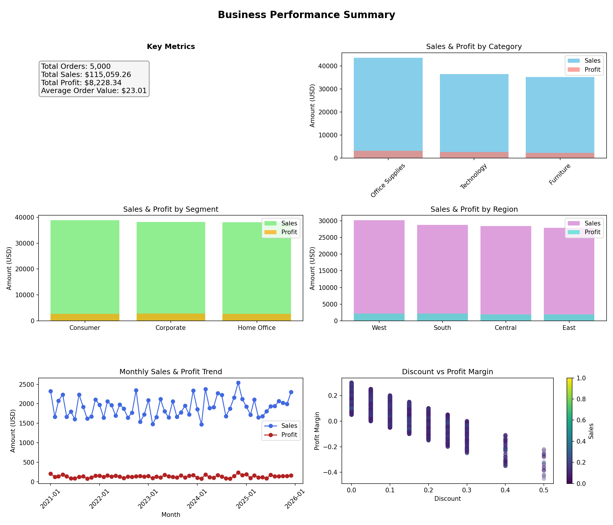

# Retail Sales Analysis & Dashboard Project

## Overview

Businesses collect vast amounts of transaction data every day.  Turning those raw records into actionable insights requires both robust data and well‑designed analysis pipelines. This project demonstrates how to build a complete analytics workflow using **synthetic retail transaction data** that mimics the structure of the popular Superstore dataset.  It includes:

* A **configurable data generator** (`generate_data.py`) that produces a synthetic dataset with realistic columns such as region, segment, category, sub‑category, ship mode, sales, discount and profit.  The structure reflects the public Superstore dataset in which each row represents a unique order line item and includes columns capturing region, segment, category, sub‑category, ship mode, sales, profit, discount and quantity ordered【479855399332414†L87-L99】.
* An **analysis script** (`analysis.py`) that computes key performance indicators (KPIs), aggregates data by category, segment and region, and builds an interactive dashboard using Plotly as well as a static PNG summary.  The synthetic dataset uses similar features and sizes to the Superstore data (the original dataset contains ~9995 rows and 21 columns).
* An interactive **dashboard (`dashboard.html`)** and **static summary image (`dashboard_summary.png`)** that present the KPIs and visualizations in a single view.

## Business Questions Addressed

1. **Which product categories generate the most sales and profit?**  By aggregating sales and profit by category, the analysis identifies high‑performing and underperforming categories.
2. **Which customer segments contribute the most to revenue?**  Grouping by consumer, corporate and home‑office segments reveals which customer types drive sales and profit.
3. **How do sales and profits vary across geographic regions?**  Regional analysis highlights geographic performance patterns.
4. **What is the overall sales and profit trend over time?**  The time‑series view shows month‑by‑month revenue and profitability, enabling detection of seasonal patterns.
5. **How does discounting affect profitability?**  A scatter plot of discount versus profit margin illustrates the impact of discounts on margin erosion and identifies discount thresholds beyond which profit turns negative.
6. **Which individual products are the top performers?**  Ranking products by sales reveals the items that contribute most to revenue.
7. **What is the average order value and how many unique orders were placed?**  KPIs summarise the number of orders, total sales, total profit and average order value.

## Dataset Design

The synthetic dataset is designed to mirror the structure of the widely used Superstore data.  In the Superstore dataset, each row corresponds to a unique order line and includes fields such as region, segment, category, sub‑category, ship mode, sales, profit, discount and quantity ordered. This design allows us to evaluate how geography, customer types and product categories influence revenue and profit. The original Superstore file contains ~9995 rows and 21 columns; the generator script can be configured via `config.yaml` to produce any number of records.

### Configuring the Generator

The `config.yaml` file defines the parameters used by the data generator:

```yaml
rows: 5000              # number of rows to generate
start_date: "2021-01-01"  # earliest order date
end_date: "2025-12-31"    # latest order date
categories:
  Furniture: ["Bookcases", "Chairs", "Tables", "Furnishings"]
  Office Supplies: ["Binders", "Paper", "Pens", "Labels", "Art", "Storage"]
  Technology: ["Phones", "Accessories", "Copiers", "Machines"]
segments: ["Consumer", "Corporate", "Home Office"]
regions: ["Central", "East", "South", "West"]
ship_modes: ["Same Day", "First Class", "Second Class", "Standard Class"]
```

## How to Run

1. **Install dependencies.**  Use Python 3.8+ and install the required packages:

   ```bash
   pip install -r requirements.txt
   ```

2. **Generate data.**  Run the generator script to produce `data.csv` and `data.xlsx`:

   ```bash
   python generate_data.py --config config.yaml --output_folder .
   ```

   This reads `config.yaml` and writes CSV/Excel files into the current folder.  You can modify `config.yaml` for different sizes or categories.

3. **Perform analysis and build the dashboard.**  Execute:

   ```bash
   python analysis.py --input_file data.csv --output_folder .
   ```

   The script computes KPIs, creates aggregated tables (e.g., `sales_by_category.csv`, `sales_by_segment.csv`, `sales_by_region.csv`, `time_series.csv`, `top_products.csv`), and generates two visual outputs:

   * **dashboard.html** – an interactive Plotly dashboard.
   * **dashboard_summary.png** – a static image summarising the dashboard.

4. **Explore the results.**  The aggregated CSV files can be opened in Excel, and the dashboard can be viewed locally. The interactive dashboard includes filters for segments and categories, tooltips on hover and dynamic scaling.

## Insights and Dashboard Explanation

After running the analysis on the default synthetic dataset, the following high‑level insights emerged:

| KPI | Value |
|---|---|
| **Total Orders** | 5000 |
| **Total Sales** | \$115,059.26 |
| **Total Profit** | \$8,228.34 |
| **Average Order Value** | \$23.01 |

**Category performance:** Office Supplies generated the highest sales (~\$43.5 K) and profit (~\$3.17 K), followed by Technology (~\$36.4 K sales, \$2.68 K profit) and Furniture (~\$35.1 K sales, \$2.38 K profit).  Segment analysis showed revenue roughly split across consumer, corporate and home‑office segments, with profits relatively balanced. The West region led sales (~\$30.1 K) and profit (~\$2.15 K), while other regions had comparable performance.

**Trend over time:** The time‑series plot displays monthly sales and profit. Even in a synthetic dataset, seasonal patterns may emerge depending on the configured date range.  In the default configuration, sales fluctuate between \$1.6 K and \$2.3 K per month.

**Discount impact:** A scatter plot shows that profits generally decline as discount rates increase.  Transactions with high discounts can result in negative profit, illustrating the trade‑off between revenue growth and margin erosion—an insight echoed in the Superstore analysis where discounting beyond 30% erodes profitability.

**Top products:** A bar chart ranks the top ten products by sales.  In the synthetic data, certain furniture and technology items dominate revenue, providing a basis for product‑level strategies.

Below is the static summary of the dashboard generated by the project.  The image displays KPI indicators, bar charts by category/segment/region, a time‑series line chart and a scatter plot of discount vs profit margin.  Opening `dashboard.html` provides an interactive version with hover tooltips and slicers.



## Files in This Repository

| File | Purpose |
|---|---|
| `config.yaml` | Configuration for synthetic data generation (number of rows, date range, categories, segments, regions, ship modes). 
| `generate_data.py` | Script to create a synthetic dataset using the configuration file.  Outputs CSV and Excel files. 
| `analysis.py` | Performs descriptive analytics on the dataset, computes KPIs, builds aggregated tables and produces the dashboard (HTML and PNG). 
| `requirements.txt` | List of Python packages required to run the scripts. 
| `data.csv` / `data.xlsx` | Generated sample dataset (can be reproduced using `generate_data.py`). 
| `sales_by_category.csv`, `sales_by_segment.csv`, `sales_by_region.csv`, `time_series.csv`, `top_products.csv` | Aggregated outputs used by the dashboard. 
| `dashboard.html` | Interactive Plotly dashboard showing KPIs and charts. 
| `dashboard_summary.png` | Static image summarising the dashboard (useful for reports). 

## Next Steps and Recommendations

This project lays the foundation for a comprehensive business intelligence workflow.  Possible extensions include:

1. **Enhance realism of the synthetic data.**  Incorporate more sophisticated distributions, marketing campaign identifiers or return orders to mimic real‑world complexities.
2. **Predictive analytics.**  Build models to forecast sales or predict customer lifetime value.  Incorporate time‑series forecasting to anticipate future revenue.
3. **Customer segmentation.**  Use clustering to identify distinct customer profiles based on purchase behaviour and tailor marketing strategies accordingly.
4. **Operational insights.**  Investigate relationships between shipping cost and profit or delivery times to optimise logistics.
5. **Integration with BI tools.**  The current dashboard uses Plotly for portability.
6. **Automated reporting.**  Schedule the data generation and analysis scripts to run periodically, automatically refreshing dashboards and sending summary reports to stakeholders.
